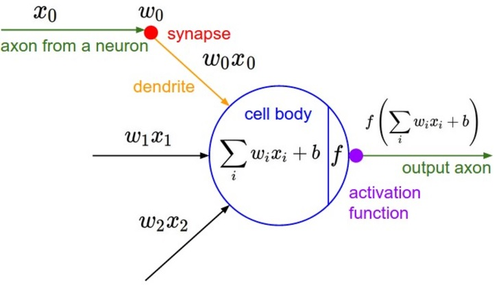
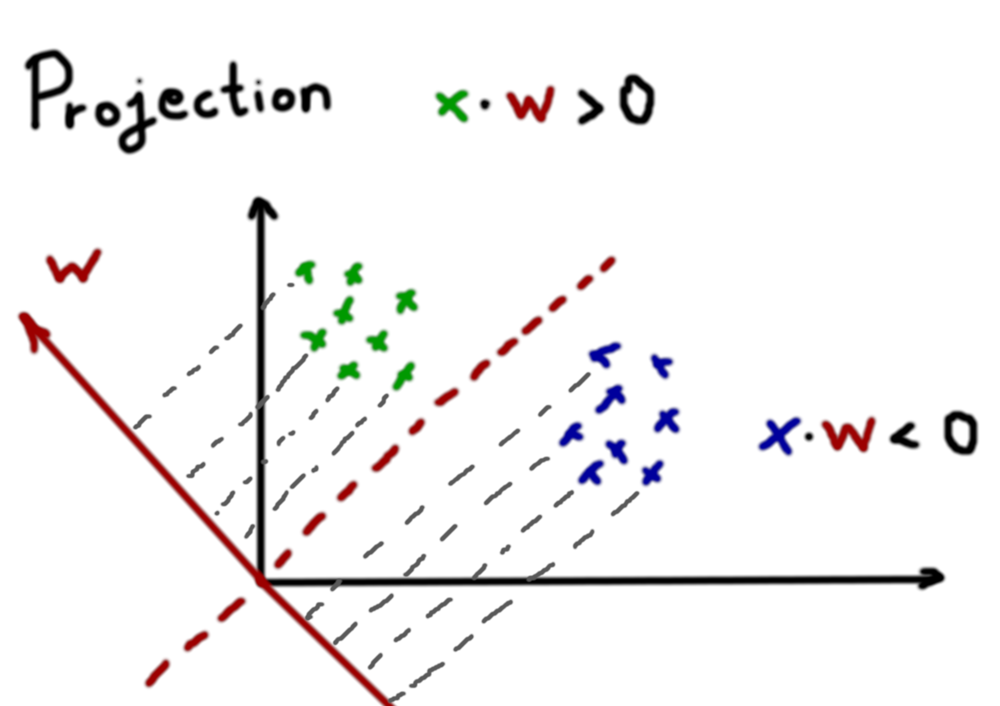

# Neural Networks Notes

## Components of Neural Networks
1. **Neurons (Nodes)**: The basic units of a neural network.
2. **Layers**: 
    - **Input Layer**: The layer that receives the input data.
    - **Hidden Layers**: Layers between input and output layers where computations are performed.
    - **Output Layer**: The layer that produces the final output.


A single neuron converting multiple inputs, times their weights, into a single output: \
$ u=w_1x_1+w_2x_2+...+w_nx_n-\theta $



Alternatively it can be written as the Dot product between the two matrices: 

$ u=w^Tx $ 

**Weight Vector**
  - $w  = [w_0,w_1,w_2,...,w_n]^T$

**Input Vector**
  - $x = [-1,x_1,x_2,...,x_n]^T$

This can be visualized as the projection of the x vector onto the w transpose vector.



Ultimately, to get the output of the neuron we pass it through an activation function:  
$ f(u) = y $

$\theta$: bias \
$w$: weights \
$x$: input \
$y$: output \
$f$: Activation function

Not all problems are linearly separable. This means that a line can't always divide our data the way we want. Later we will be learning how to divide non-linear problems by using curves, imaginary numbers, etc.

## Training

### Squared difference
In learning algorithms like LMS (Least Mean Squares), we aim to minimize the squared difference between the predicted output y(k) and the desired output d(k). It is designed to reduce the mean squared error (MSE), which quantifies the magnitude of this difference in a meaningful way. Here’s why LMS is suitable for this objective:

1. **Squared Error is Always Positive**: By squaring, we ensure that all errors contribute positively to the total error, regardless of their direction (positive or negative). This prevents errors from canceling each other out.
2. **Sensitive to Large Errors**: Squaring emphasizes larger errors more than smaller ones, which is desirable in many applications. It encourages the algorithm to focus on reducing significant deviations between y(k) and d(k).

3. **Gradient Descent on a Smooth Error Surface**: The squared error function has a smooth, convex shape, which makes it suitable for optimization with gradient descent:
    - Convex Shape: The error surface is convex with a single global minimum, meaning that if we start gradient descent from any initial weight configuration, it will eventually converge toward the optimal solution.
    - Efficient Convergence: The LMS algorithm takes small, proportional steps in the direction of the negative gradient of the error function. This helps to iteratively reduce the error in a stable manner without overshooting, leading to efficient convergence to a minimum.


$Error(k)=\frac{1}{2}(d(k)-y(k))^2$ \
$Error(k)=\frac{1}{2}(w^Tx_k-y(k))^2$ \
$\frac{\partial(Error(k))}{\partial(w)}=\frac{\partial(\frac{1}{2}(w^Tx_k-y(k))^2}{\partial(w)}$ \
$\frac{\partial(Error(k))}{\partial(w)}=(d(k)−y(k))x(k)$

### Weight calibration
$ w(k+1) = w(k)+\beta(d(k)-y(k))x(k)$

This formula represents a weight update rule commonly used in training neural networks, specifically in the context of a simple perceptron or linear regression model.

$w(k)$: This represents the weight vector at the ( k )-th iteration.

$w(k+1)$: This represents the updated weight vector for the next iteration, ( k+1 ).

$ \beta $: This is the learning rate, a small positive constant that controls how much the weights are adjusted during each iteration.

$d(k)$: This is the desired output (or target value) at the ( k )-th iteration.

$y(k)$: This is the actual output produced by the model at the ( k )-th iteration.

$x(k)$ : This is the input vector at the ( k )-th iteration.

### Intricacies of the learning rate: $\beta$
The learning rate $\beta$ controls the size of the adjustment. 
- If $\beta$ is too large, the weights might oscillate or diverge. 
- If $\beta$ is too small, the learning process will be slow.


=======================================================

### Activation Function in Neural Networks
An activation function in a neural network defines the output of a node given an input or set of inputs. It introduces non-linearity into the network, allowing it to learn complex patterns. Common activation functions include:

1. **Sigmoid**: $ \sigma(x) = \frac{1}{1 + e^{-x}} $
2. **ReLU (Rectified Linear Unit)**: $ f(x) = \max(0, x) $
3. **Tanh**: $ \tanh(x) = \frac{2}{1 + e^{-2x}} - 1 $

Each activation function has its own characteristics and is chosen based on the specific requirements of the neural network model.

$f$ can be a step function:
```
     f                 f  
   ↙   ↘     or     ↙   ↘ 
  1      0         -1      1
```


Training a neural network involves several key steps:

1. **Initialize Weights and Biases**: Start with small random values for weights and biases.

2. **Forward Propagation**:
  - Pass the input data through the network.
  - Compute the output at each layer using the linear transformation and activation function.
  - Obtain the final output of the network.

3. **Compute Loss**:
  - Use a loss function to measure the difference between the predicted output and the actual output.
  - Common loss functions include Mean Squared Error (MSE) for regression and Cross-Entropy Loss for classification.

4. **Back-propagation**:
  - Calculate the gradient of the loss function with respect to each weight and bias.
  - Use the chain rule to propagate the error backward through the network.

5. **Update Weights and Biases**:
  - Adjust the weights and biases using an optimization algorithm like Gradient Descent.
  - Update rule: $ W = W - \eta \frac{\partial L}{\partial W} $, where $ \eta $ is the learning rate.

6. **Repeat**:
  - Iterate over the dataset multiple times (epochs) to continuously improve the model.
  - Each iteration involves forward propagation, loss computation, backpropagation, and weight update.

### Example Workflow
1. **Initialize**: Randomly initialize weights and biases.
2. **Forward Propagation**: Compute outputs for a batch of input data.
3. **Loss Calculation**: Measure the error using a loss function.
4. **Backpropagation**: Compute gradients of the loss with respect to weights and biases.
5. **Update**: Adjust weights and biases using the gradients.
6. **Repeat**: Continue the process for multiple epochs until the model converges.

By following these steps, you can train a neural network to learn from data and make accurate predictions.


Step-by-Step Breakdown:
Error Calculation: ( d(k) - y(k) )

This term calculates the difference between the desired output and the actual output, which is the error at the ( k )-th iteration.
Gradient Calculation: ( (d(k) - y(k)) x(k) )

This term represents the gradient of the error with respect to the weights. It indicates how the weights should be adjusted to reduce the error.
Weight Update: ( w(k+1) = w(k) + \beta (d(k) - y(k)) x(k) )

The weights are updated by adding the product of the learning rate, the error, and the input vector to the current weights. This adjustment aims to reduce the error in future iterations.
Intuition:
The formula adjusts the weights in the direction that reduces the error between the predicted output and the desired output.


This weight update rule is fundamental in training neural networks and helps the model learn from the data by iteratively reducing the prediction error.


## Types of Neural Networks
1. **Feedforward Neural Networks (FNN)**: Information moves in one direction from input to output.
2. **Convolutional Neural Networks (CNN)**: Primarily used for image processing tasks.
3. **Recurrent Neural Networks (RNN)**: Suitable for sequential data like time series or natural language.


## Training Neural Networks
1. **Forward Propagation**: Process of passing input data through the network to get the output.
2. **Loss Function**: Measures the difference between the predicted output and the actual output.
3. **Backpropagation**: Algorithm for adjusting the weights of the network to minimize the loss.

## Common Algorithms
1. **Gradient Descent**: Optimization algorithm to minimize the loss function.
2. **Stochastic Gradient Descent (SGD)**: A variant of gradient descent that updates weights using a single training example at a time.

## Applications
1. Image and speech recognition
2. Natural language processing
3. Autonomous vehicles
4. Medical diagnosis

## Mathematical Foundation of Neural Networks

### Linear Transformation
A neural network layer performs a linear transformation on the input data:
$ z = Wx + b $
where:
- $ z $ is the output,
- $ W $ is the weight matrix,
- $ x $ is the input vector,
- $ b $ is the bias vector.

### Activation Function
The output of the linear transformation is passed through an activation function f: 
$ a = f(z) $
Common activation functions include Sigmoid, ReLU, and Tanh.

### Forward Propagation
For a network with multiple layers, forward propagation involves applying the linear transformation and activation function at each layer:
$ a^{l} = f(W^{l}a^{(l-1)} + b^{l}) $
where \( l \) denotes the layer index.

### Loss Function
The loss function \( L \) quantifies the difference between the predicted output $ \hat{y} $ and the actual output $ y $:
$ L(y, \hat{y}) $
Common loss functions include Mean Squared Error (MSE) for regression tasks and Cross-Entropy Loss for classification tasks.

### Back-propagation
Back-propagation is used to compute the gradient of the loss function with respect to each weight by applying the chain rule:
$ \frac{\partial L}{\partial W^{(l)}} = \frac{\partial L}{\partial a^{(l)}} \cdot \frac{\partial a^{(l)}}{\partial z^{(l)}} \cdot \frac{\partial z^{(l)}}{\partial W^{(l)}} $
These gradients are then used to update the weights using an optimization algorithm like Gradient Descent.

### Gradient Descent
Weights are updated to minimize the loss function:
$ W^{(l)} = W^{(l)} - \eta \frac{\partial L}{\partial W^{(l)}} $
where $ \eta $ is the learning rate.
